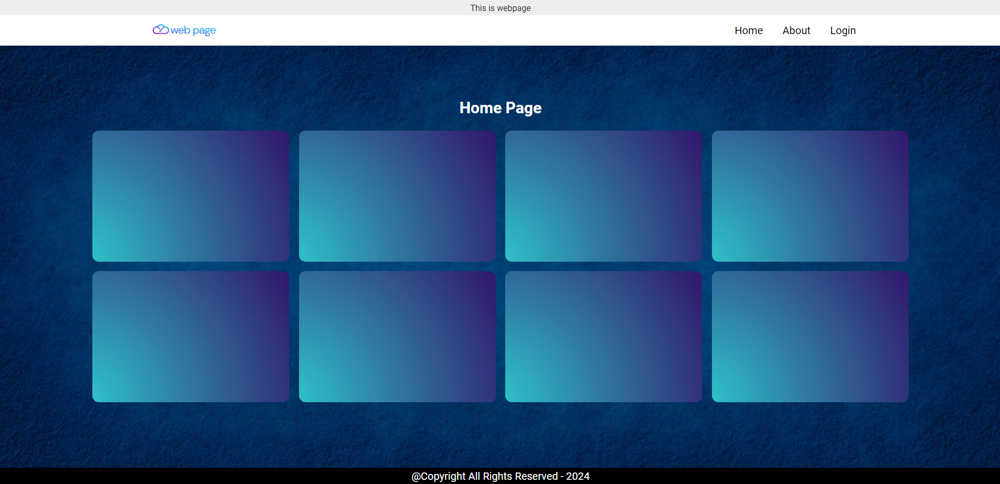
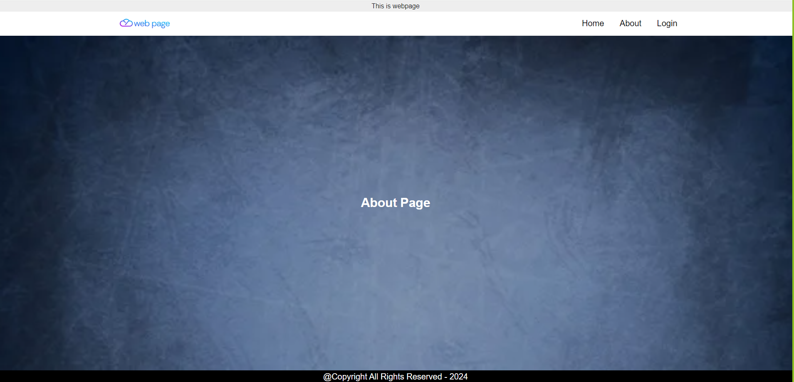
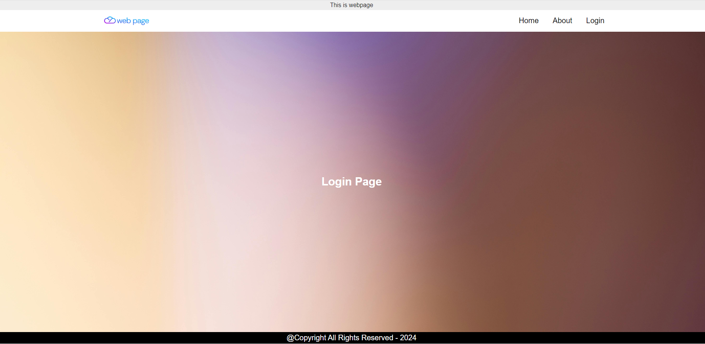
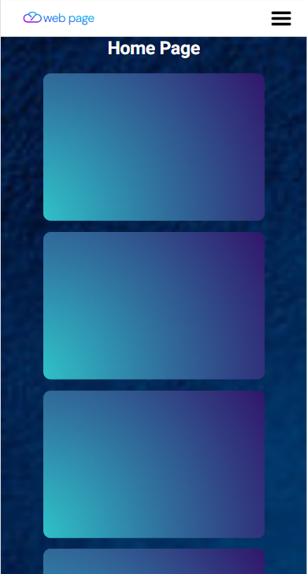
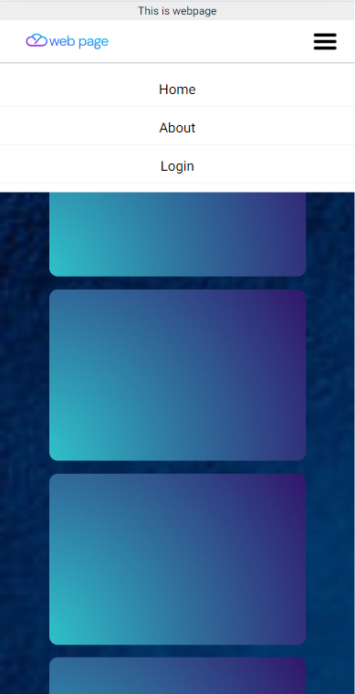

# HTML and CSS Basics Assignment

This is a simple webpage layout built using _HTML_ _CSS_ and _JavaScript_.
The assignment tasks include creating an HTML file with specific components and styling the webpage using CSS.

## Important Links

- [Deployed Link]()

- [Repo Link](https://github.com/artisonii/saraltech_frontend)

## Objective

The objective of this assignment is to showcase the ability to create a basic webpage layout using HTML and style it using CSS.

## Tasks

#### Create HTML File:

1. Developed an HTML file named "index.html" with the following components:

- Header section - containing the title of the webpage.
- Nav bar - Home , About & Login navigation links.
- Main content section with placeholder text.
- Footer section - containing copyright information.

2. Styled with CSS:

- Applied a background image to the webpage.
- Customized the font family, size, and color for the text.
- Utilized CSS selectors to style the header, navigation bar, main content, and footer sections.
- Implemented responsive design principles to ensure the webpage is mobile-friendly.

## How to Run

1. Clone this repository to your local machine.
2. Open index.html in a web browser to view the webpage.

## Technologies Used

- HTML
- CSS
- JavaScript

## Screenshots

- For Large Screen

  

  

- For Small Screen

  

# Created by Arti Soni

- [LinkedIn](https://www.linkedin.com/in/arti-soni/)
- [Portfolio](https://artisonii.github.io/)
- [GitHub](https://github.com/artisonii)
